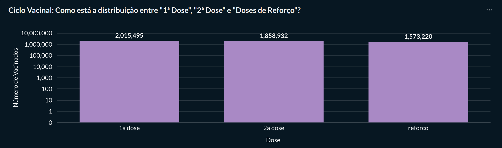
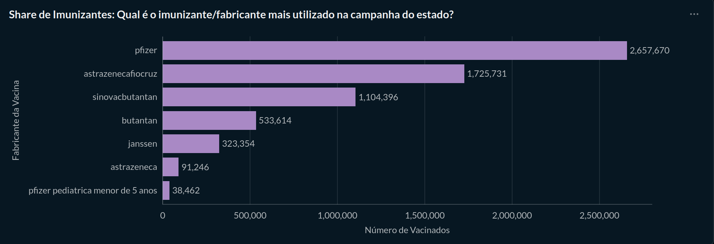
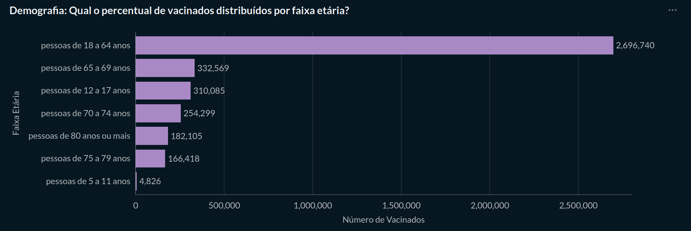
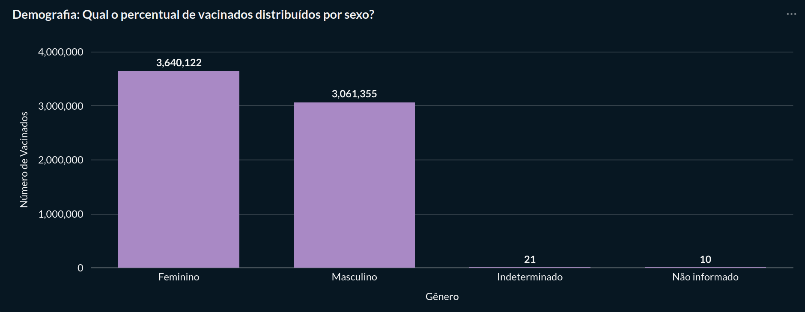
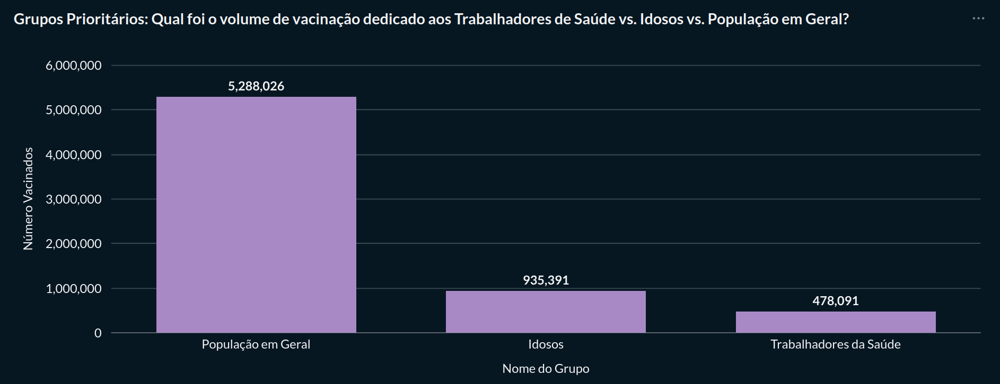
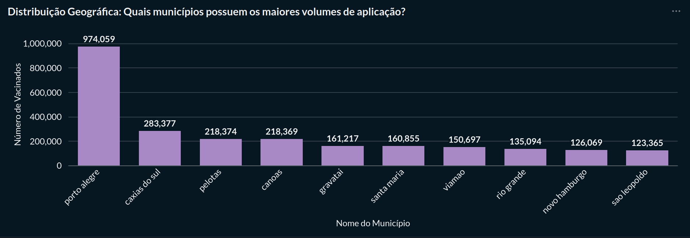
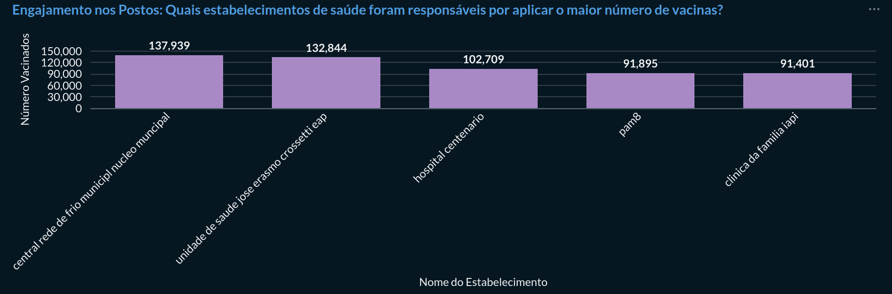

# Dashboard de Vacinação COVID-19 no Rio Grande do Sul

Este projeto apresenta um **dashboard de Business Intelligence** com dados de vacinação contra a COVID-19 no estado do **Rio Grande do Sul**, utilizando dados públicos disponibilizados pelo Open Data SUS.

O objetivo do dashboard é permitir a **análise da campanha de vacinação** sob diferentes perspectivas, incluindo evolução temporal, perfil demográfico da população vacinada e distribuição geográfica das aplicações.

O dashboard foi desenvolvido utilizando a ferramenta de BI **Metabase** e está organizado em **três seções principais**.

---

# Estrutura do Dashboard

## 1. Evolução da Vacinação

Esta seção apresenta indicadores que mostram **como a campanha de vacinação evoluiu ao longo do tempo**.

### Volume de Imunização

* **Tipo de gráfico:** Linha
* **Filtro disponível:** Dia, mês, trimestre e ano

**Pergunta de negócio**

> Qual é o total de doses aplicadas ao longo do tempo?
> 
> 
> 

---

### Ciclo Vacinal

* **Tipo de gráfico:** Barras verticais

Mostra a distribuição das aplicações entre:

* 1ª dose
* 2ª dose
* Doses de reforço

**Pergunta de negócio**

> Como está a distribuição das aplicações dentro do ciclo vacinal?
> 

---

### Share de Imunizantes

* **Tipo de gráfico:** Barras horizontais

**Pergunta de negócio**

> Qual imunizante (fabricante) foi mais utilizado na campanha de vacinação no estado?
> 

---

# 2. Perfil Demográfico da População Vacinada

Esta seção apresenta informações sobre **quem recebeu as vacinas**, permitindo entender melhor o perfil da população atendida.

### Distribuição por Faixa Etária

* **Tipo de gráfico:** Barras horizontais

**Pergunta de negócio**

> Qual é o número de vacinados distribuídos por faixa etária?
> 

---

### Distribuição por Sexo

* **Tipo de gráfico:** Barras verticais

**Pergunta de negócio**

> Qual é o número de vacinados distribuídos por sexo?
> 

---

### Grupos Prioritários

* **Tipo de gráfico:** Barras verticais

**Pergunta de negócio**

> Qual foi o volume de vacinação destinado aos diferentes grupos prioritários?

Exemplos de grupos analisados:

* Trabalhadores da saúde
* Idosos
* População em geral

* > 

---

# 3. Distribuição Geográfica da Vacinação

Esta seção apresenta informações sobre **onde as vacinas foram aplicadas**, permitindo identificar padrões regionais e operacionais da campanha.

### Distribuição por Município

* **Tipo de gráfico:** Barras verticais

**Pergunta de negócio**

> Quais municípios possuem os maiores volumes de aplicação de vacinas?
> > 

---

### Engajamento dos Estabelecimentos de Saúde

* **Tipo de gráfico:** Barras verticais

**Pergunta de negócio**

> Quais estabelecimentos de saúde foram responsáveis por aplicar o maior número de vacinas?
> 

---

# Tecnologias Utilizadas

* PostgreSQL
* Python (ETL e tratamento de dados)
* Data Warehouse (modelo dimensional)
* Metabase (visualização e dashboards)

---

# Fonte dos Dados

Os dados utilizados neste projeto foram obtidos a partir do:

**Open Data SUS – Campanha Nacional de Vacinação contra a COVID-19**

---

# Objetivo do Projeto

Este projeto foi desenvolvido com fins **educacionais e analíticos**, com o objetivo de demonstrar a construção de um **pipeline completo de Business Intelligence**, incluindo:

* Extração e tratamento de dados
* Modelagem de Data Warehouse
* Construção de dashboards analíticos
* Geração de insights a partir de dados públicos

